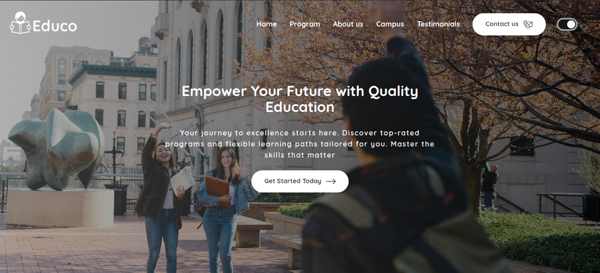
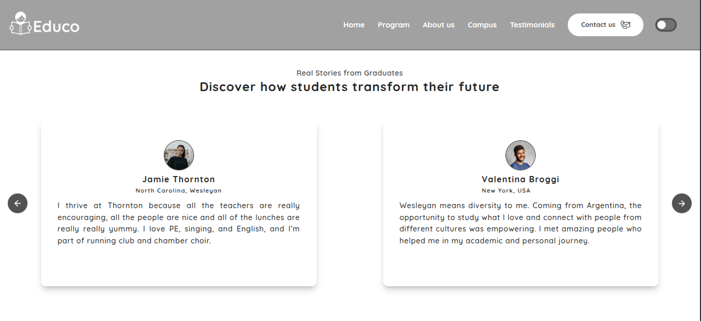
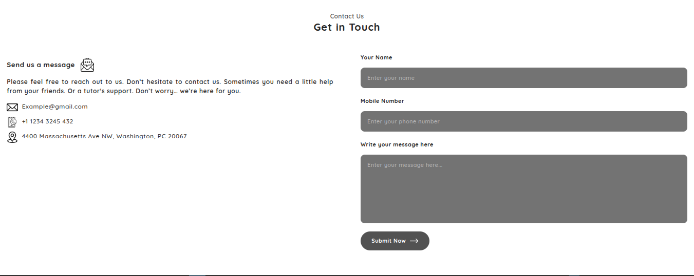

# Educo - Modern Education Portfolio

Educo is a fully responsive, high-performance education portal built with **React JS**, **Vite**, and **Tailwind CSS**. It features smooth navigation, a clean UI for program details, and a functional contact system.

## 🚀 Key Features
* **Fully Responsive:** Optimized for Mobile, Tablet, and Desktop views.
* **Smooth Navigation:** Integrated with `react-scroll` for a seamless single-page experience.
* **Dynamic Dark/Light Mode:** Integrated a theme switcher using React Context API and Tailwind CSS to ensure a comfortable viewing experience in any lighting.
* **Functional Contact Form:** Powered by Web3Forms for direct email responses.
* **Dynamic Testimonial Slider:** A custom-built slider using React Hooks and Framer-like transitions.
* **State Management:** Efficient data handling using React Context API.

## 🛠️ Tech Stack & Packages
* **Frontend:** [React JS](https://reactjs.org/) + [Vite](https://vite.dev/)
* **Styling:** [Tailwind CSS](https://tailwindcss.com/)
* **Utilities:**
    * `react-scroll` (Smooth scrolling)
    * `web3forms` (Contact form backend)
    * Context API (State Management)

## 📸 Screenshots

## ⚙️ Installation & Setup
1. Clone the repository:
   `git clone https://github.com/mahin527/educo.git`
2. Install dependencies:
   `npm install`
3. Run the development server:
   `npm run dev`

---
### 🤝 Connect with Me
- **Name:** Mahin Hasan
- **Email:** hasan.mahin527@gmail.com
- **Role:** Aspiring Full-Stack Web Developer & Shopify Expert
- **Goal:** Building high-quality remote solutions.